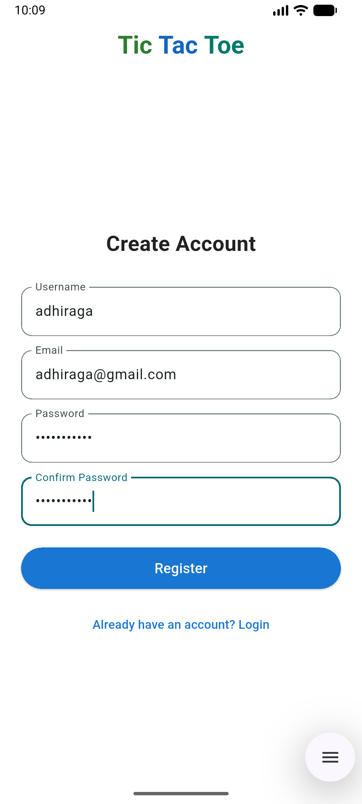
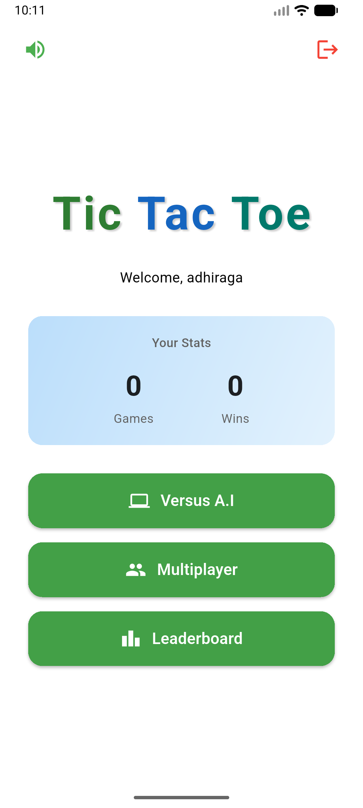
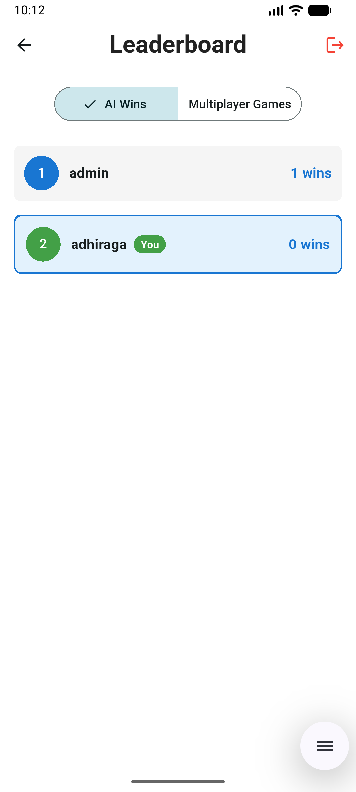
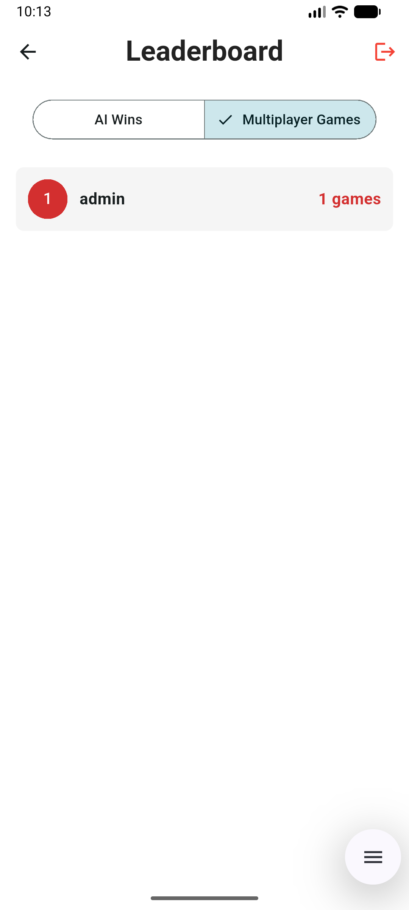
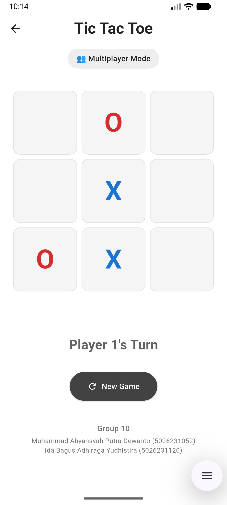
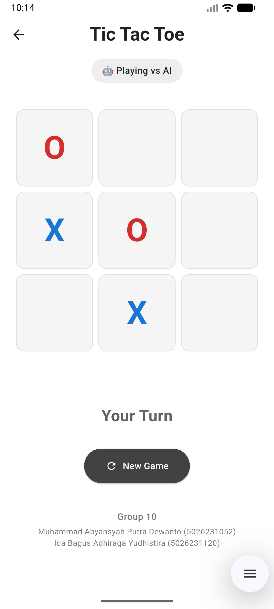
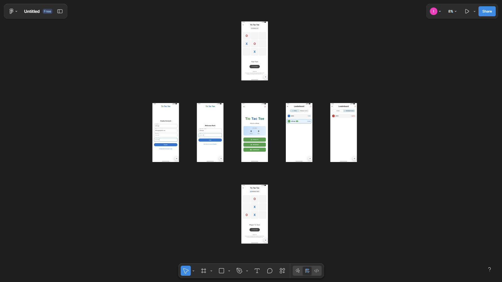

# XO Battle - Tic Tac Toe Game with Firebase Integration

## Group Members

Group 10 Emerging Technology
Muhammad Abyansyah putra Dewanto 5026231052
Ida Bagus Adhiraga Yudhistira 5026231120

## Project Description

XO Battle is a modern Tic Tac Toe game built with Flutter, with Firebase handling user login and the leaderboard. Players can choose to play against AI or another player in multiplayer mode. Game results are saved to Firestore and reflected immediately on the leaderboard, so scores update as matches finish.

## Features

- User Authentication: Register and log in using email or username
- AI Opponent: Play against a computer with intelligent move logic
- Multiplayer Mode: Play against another human player
- Real-time Leaderboard: View rankings based on AI and multiplayer wins
- Firebase Integration: Secure authentication and data storage
- Input Validation: Email format checks, password strength, and confirmation

## Technologies Used

- Flutter 3.35.7
- Firebase Core 3.15.2
- Firebase Authentication 5.7.0
- Cloud Firestore 5.6.12
- Dart

## Requirements

- Flutter SDK 3.35.7 or later
- Android SDK with API level 24 or higher
- Firebase account and project

## Installation Steps

### 1. Clone the repository

```bash
git clone https://github.com/adhiraga/CapstoneTEKBER.git
cd CapstoneTEKBER/tictactoo
```

### 2. Install Flutter dependencies
   
```bash
flutter pub get
```

### 3. Firebase Setup

Create a Firebase project on Firebase Console at https://console.firebase.google.com

Enable Firebase Authentication with Email/Password provider

Create Firestore database with the following collection structure:

**Collection: users**
- username: string
- email: string
- password: string
- aiWins: integer (default: 0)
- multiplayerWins: integer (default: 0)
- createdAt: timestamp

Configure security rules for Firestore (allow authenticated users to read/write their own documents)

The Firebase configuration is automatically handled by google-services.json in the android/app/ directory

### 4. Build and Run

```bash
flutter clean
flutter pub get
flutter run
```

### Running on Physical Device

```bash
flutter run -d <device-id>
```

To find available devices: `flutter devices`

## Project Structure

```
lib/
  main.dart                    # App entry point and home screen
  firebase_options.dart        # Firebase configuration
  models/
    game_state.dart           # Game logic and AI strategy
  screens/
    auth_screen.dart          # Login and registration UI
    leaderboard_screen.dart   # Leaderboard display

android/
  app/
    google-services.json      # Firebase configuration file
```

## Firebase Setup Notes

### Authentication Flow

**Registration process:**
- User enters username, email, and password
- Password must be at least 6 characters
- Email must be in valid format
- Password confirmation is required
- Username is checked for uniqueness in Firestore
- User is created in Firebase Authentication
- User data is stored in Firestore collection

**Login process:**
- User can login with either username or email
- If username is used: system queries Firestore to find the email
- Password is verified against the stored credentials
- On successful login, user is directed to game selection screen

### Firestore Rules

The following security rules should be applied:

```
rules_version = '2';
service cloud.firestore {
  match /databases/{database}/documents {
    match /users/{userId} {
      allow read, write: if request.auth.uid == userId;
    }
  }
}
```

### Database Structure

**users collection:**
- Document ID: Firebase Auth UID
- username: Unique identifier chosen by user
- email: User email address
- password: User password (stored for username login verification)
- aiWins: Count of wins against AI opponent
- multiplayerWins: Count of wins in multiplayer matches
- createdAt: Account creation timestamp

## Game Modes

### AI Mode
- Human player (X) vs Computer (O)
- AI uses strategic move selection:
  1. Check for immediate winning move
  2. Block opponent's winning move
  3. Take center position if available
  4. Take corner positions
  5. Take any available position
- Game result is recorded to user's aiWins counter

### Multiplayer Mode
- Player 1 (X) vs Player 2 (O)
- Both players play on the same device
- Game result tracking available for player 1

## Build Instructions

### Debug Build

```bash
flutter build apk --debug
```

### Release Build

```bash
flutter build apk --release
```

The APK will be located in `build/app/outputs/flutter-apk/`

## Troubleshooting

### Firebase Connection Issues

If the app cannot connect to Firebase:
1. Verify Google Services plugin is properly configured
2. Check that google-services.json is in android/app/ directory
3. Ensure Firebase Authentication is enabled in Firebase Console
4. Verify Firestore database is created and rules are properly set
5. Check network connectivity

### Build Errors

If you encounter build errors:
1. Run `flutter clean` to remove build artifacts
2. Run `flutter pub get` to reinstall dependencies
3. Update Flutter to latest stable version: `flutter upgrade`

## Screenshots











## Reflection & Contribution
